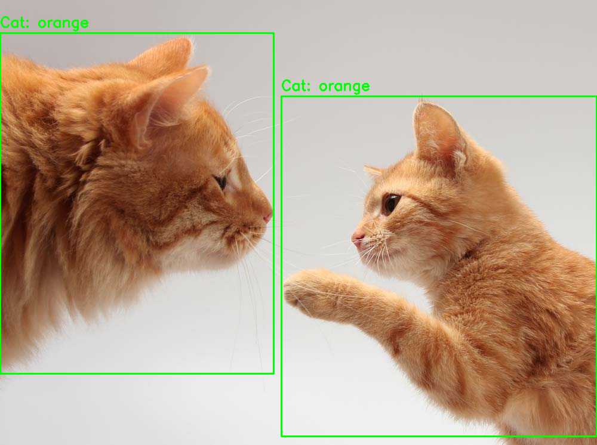

# Cat Detector

Программа для обнаружения кошек на изображении и определения их цвета (рыжий, черный, белый или смешанный) с помощью opencv и модели YOLOv8.



## Установка

Создайте виртуальное окружение:

```bash
python -m venv .venv
```

Активируйте его:

### Linux / macOS

```bash
source .venv/bin/activate
```

### Windows

```bash
.venv\Scripts\activate
```

## Использование

```bash
python main.py <путь к изображению>
```
